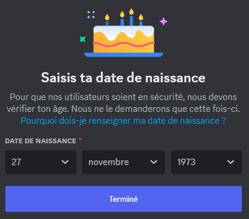
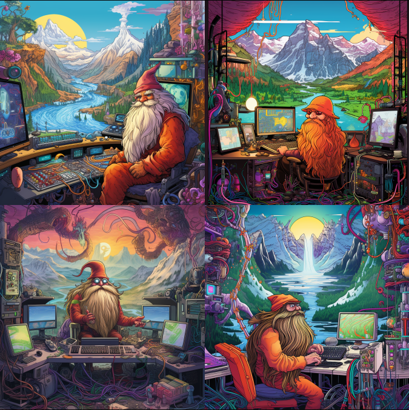

# Création d'un nouveau serveur Discord

## Introduction

**Qu'est-ce que Midjourney ?**

*Midjourney* est, sans conteste, le logiciel de génération d'images le plus en vogue de l'année 2023. Sa renommée découle de sa convivialité remarquable, permettant la création rapide d'images d'une qualité incontestable.

Concrètement, *Midjourney* se présente comme un logiciel de création d'images propulsé par l'intelligence artificielle, qui exploite un algorithme d'apprentissage préalablement formé sur une vaste gamme d'images. Toutefois, pour son utilisation actuelle, une connexion à un serveur Discord est impérative.

Par conséquent, deux éléments sont incontournables : tout d'abord, la possession d'un compte Discord, suivi de la création d'un compte *Midjourney*.

> ⚠️ **Important :** Par souci de sécurité, l'accès aux sites essentiels est restreint par le proxy d'entreprise. Par conséquent, j'ai suivi ce tutoriel depuis un environnement personnel afin de créer ma première image.

## Création d'un compte Discord

Pour créer un compte Discord, suivez ces étapes :

1. Accédez à l'adresse URL [https://discord.com/](https://discord.com/).

2. À partir de cette interface, deux alternatives s'offriront à vous :

   - Téléchargez la version du logiciel Discord adapté à votre système d'exploitation (Windows, Linux, Mac, Android, iOS).
   
   - Utilisez la version en ligne via votre navigateur Internet.

Dans le cadre de ce tutoriel, je suis resté en ligne et j'ai alors démarrer la procédure d'inscription :

J'ai fourni les informations attendues :

> ⚠️ **Important :** Fermez la fenêtre qui vous propose de créer votre premier serveur Discord.

## Création d'un compte Midjourney

Pour créer un compte Discord, suivez ces étapes :

1. Accédez à l'adresse URL [https://www.midjourney.com/](https://www.midjourney.com/).

2. Depuis cette page en bas à droite cliquez sur **Join the Beta** :

Midjourney va alors vous inviter :

Sous Windows, il est possible qu'une autorisation émanant du pare-feu soit nécessaire afin de permettre la circulation des flux réseau entre un serveur Discord et votre ordinateur.

Saisisez une date de naissance :

Finalisez l'inscription :

## Première connexion à Midjourney

Accédez à l'adresse URL [https://www.midjourney.com/](https://www.midjourney.com/). Avant de commencer pense à couper votre micro !

En bas à gauche de l'écran vous trouvez quelques icones dont celle concernant le micro :

Ensuite, veuillez cliquer sur l'une des options vous permettant d'accéder à un salon réservé aux néophytes (nouveaux arrivants).

Ici, j'ai choisi **newbies-29**

Vous pouvez observer que les échanges dans ce salon sont très significatifs et que vous n'êtes pas seul. Vous avez la possibilité d'explorer et d'accéder à l'ensemble des créations des membres connectés, de la même manière qu'ils ont accès aux vôtres.

## Création d'un serveur Discord personnel 

Le principal avantage d'un serveur personnel réside naturellement dans sa capacité à vous préserver d'être submergé par les créations de tous les autres utilisateurs du salon auquel vous êtes connecté.

Cliquez sur le symbole plus :

Créer le mien :

Pour mes amis et moi :

Donnez un nom à votre serveur

Voilà votre serveur est créé. 

Maintenant allez dans le serveur de Midjouney en cliquant sur l'icone :

Affichez la liste des membres :

Cliquez sur le bot de Midjourney pour l'ajouter à votre serveur :

Cliquez sur le bouton **Ajouter au serveur**

Dans la liste déroulante vous sélectionnez le nom de votre serveur puis vous confirmez les paramètres standard avant de procéder de cliquez sur le bouton "Aller à votre serveur xxxxx".

Ici, vous serez donc seul et il sera bien plus aisé de retrouver vos créations. De plus, vous serez le seul à avoir accès à celles-ci, ainsi que toute personne avec laquelle vous partagerez l'autorisation d'accès.

## Ma première image généré

Au bas de l'écran, veuillez entrer /imagine dans la ligne, et vous découvrirez une liste immédiatement en dessus qui offre une fonction d'auto-complétion avec des suggestions qui se réduisent à chaque lettre que vous tapez :

Validez pour afficher le prompt où vous pourrez saisir **en anglais** vos instructions à Midjourney afin qu'il crée une image conformément à vos directives.

Voici une première tentative qui n'a pas donné le résultat escompté. Il semble, déjà, que Midjourney ne soit pas familier avec les Looney Tunes.

Le prompt, en anglais :

<strong>Yosemite Sam</strong>, the mainframe support guru, is sitting at a desk, surrounded by cables, screens, and computer peripherals. He is coding and fixing software bugs, and he looks focused. Behind him, a window opens onto a fantasy landscape. The landscape is composed of snow - capped mountains, lush forests, and flying dragons. The image is colorful and vibrant.

 Les résultats 

Midjourney propose systématiquement quatre options, chaque option étant accompagnée de deux séries de choix, notées de U1 à U4 et de V1 à V4. Lorsque vous choisissez l'une des options Ux, Midjourney vous présente de nouvelles options pour l'image en cours. En revanche, en optant pour l'une des options Vx, vous pouvez demander une variation de l'image, et Midjourney vous proposera alors quatre nouvelles images du même style.

L'icône située à l'extrême droite, représentant deux flèches s'enroulant dans un cercle, permet de demander à Midjourney de créer quatre nouvelles images distinctes, toujours en se basant sur le texte de votre prompt saisi précédemment.

## Utilisation d'une image de référence

L'idée consiste à fournir à Midjourney une image de référence en plus d'un texte d'instructions, tout en précisant le poids de cette image dans les directives.

Midjourney reconnaît les formats d'image suivants : png, gif et jpg.

Je rechercheune image sur Internet et je copie le lien d'accès dans le presse papier Windows :

